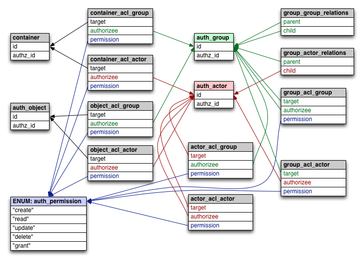

Bifrost PostgreSQL Schema
=======================

# Modifying the Schema

* [Set up and Use Sqitch](doc/sqitch_background.md)

## Ensuring Modifications are Applied in Upgrades

Upgrades are not automatically applied when chef-server upgrades are
installed/reconfigured.  In order to have a schema change applied,
you must add a partybus migration with content similar to the following:

    define_upgrade do
      if Partybus.config.bootstrap_server
        must_be_data_master
        run_sqitch("target-tag-name", 'oc_bifrost')
    end

# Testing

We use [pgTAP][] to test both the schema and the stored procedures in
the database.

* [Developer Setup for Local Testing](doc/system_setup_for_testing.md)
* [Running pgTAP Tests for Authz](doc/running_pgtap.md)
* [Writing pgTAP Tests for Authz](doc/writing_tests.md)

# Debugging

Support for debugging a live Authz system.  Currently consists of
special SQL views that can be queried using `psql`.

* [SQL Debug Schema](doc/debug_schema.md)

[pgTAP]:http://pgtap.org
