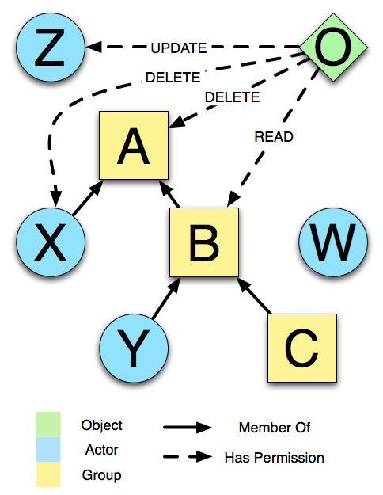

debug.object_acl View
=====================

Use this view to see entire ACLs of a given object.  This includes
permissions for actors and groups, both directly and indirectly
defined.

# View Columns

* **object**: The Authz ID of an object
* **authorizee**: The Authz ID of the actor / group that has a
    permission
* **type**: Either `'actor'` or `'group'`; refers to **authorizee**
* **permission**: One of `'create'`, `'read'`, `'update'`, `'delete'`,
    or `'grant'`
* **directly_granted**: `TRUE` or `FALSE`; indicates whether
    **authorizee** was directly granted **permission** on **object**,
    or if it has the permission by virtue of a (possibly nested) group
    membership.

Only granted permissions are shown; if an actor or group does not show
up for a given permission, they do not have that permission.


# Usage Examples

The diagram illustrates the state of the database for the following
queries.  Actor "X" in the diagram has an Authz ID of
"xxxxxxxxxxxxxxxxxxxxxxxxxxxxxxxx", and so forth. Note that the Authz
IDs shown are _not legal_, but used for ease of comprehension.

Also note that some of these queries are not necessarily ones that
will prove to be useful in practice; they are meant to illustrate what
kinds of information the view can present.



## Actors and groups that have any permission on a given object

``` sql
SELECT distinct(authorizee), type, permission
FROM debug.object_acl
WHERE object = 'oooooooooooooooooooooooooooooooo';
```

```
            authorizee            | type  | permission
----------------------------------+-------+------------
 aaaaaaaaaaaaaaaaaaaaaaaaaaaaaaaa | group | delete
 bbbbbbbbbbbbbbbbbbbbbbbbbbbbbbbb | group | read
 bbbbbbbbbbbbbbbbbbbbbbbbbbbbbbbb | group | delete
 cccccccccccccccccccccccccccccccc | group | read
 cccccccccccccccccccccccccccccccc | group | delete
 xxxxxxxxxxxxxxxxxxxxxxxxxxxxxxxx | actor | delete
 yyyyyyyyyyyyyyyyyyyyyyyyyyyyyyyy | actor | read
 yyyyyyyyyyyyyyyyyyyyyyyyyyyyyyyy | actor | delete
 zzzzzzzzzzzzzzzzzzzzzzzzzzzzzzzz | actor | update
(9 rows)
```

## Actors with indirectly-granted READ permission on an object

``` sql
SELECT distinct(authorizee)
FROM debug.object_acl
WHERE object = 'oooooooooooooooooooooooooooooooo'
AND type = 'actor'
AND permission = 'read'
AND NOT directly_granted;
```

```
            authorizee
----------------------------------
 yyyyyyyyyyyyyyyyyyyyyyyyyyyyyyyy
(1 row)
```

## Objects an actor has DELETE permission on

``` sql
SELECT distinct(object)
FROM debug.object_acl
WHERE authorizee = 'xxxxxxxxxxxxxxxxxxxxxxxxxxxxxxxx'
AND type = 'actor'
AND permission = 'delete';
```

```
              object
----------------------------------
 oooooooooooooooooooooooooooooooo
(1 row)
```

## Actors with either READ or DELETE permission on an object

``` sql
SELECT distinct(authorizee), type, permission
FROM debug.object_acl
WHERE object = 'oooooooooooooooooooooooooooooooo'
AND type = 'actor'
AND permission IN ('read', 'delete');
```

```
            authorizee            | type  | permission
----------------------------------+-------+------------
 yyyyyyyyyyyyyyyyyyyyyyyyyyyyyyyy | actor | delete
 yyyyyyyyyyyyyyyyyyyyyyyyyyyyyyyy | actor | read
 xxxxxxxxxxxxxxxxxxxxxxxxxxxxxxxx | actor | delete
(3 rows)
```

## Actors with DELETE permission granted both directly _and_ indirectly on an object

``` sql
SELECT authorizee
FROM debug.object_acl
WHERE object = 'oooooooooooooooooooooooooooooooo'
AND type = 'actor'
AND permission = 'delete'
GROUP BY authorizee
HAVING COUNT(*) = 2
```

```
            authorizee
----------------------------------
 xxxxxxxxxxxxxxxxxxxxxxxxxxxxxxxx
(1 row)
```

This arises when an actor has a permission directly granted, and is
also a member of a group that has the same permission.

The query works because there will be a pair of otherwise identical
records in the view, differing in the value of their
`directly_granted` attribute.  This is also the reason for the use of
`distinct` in other example queries on this page.
